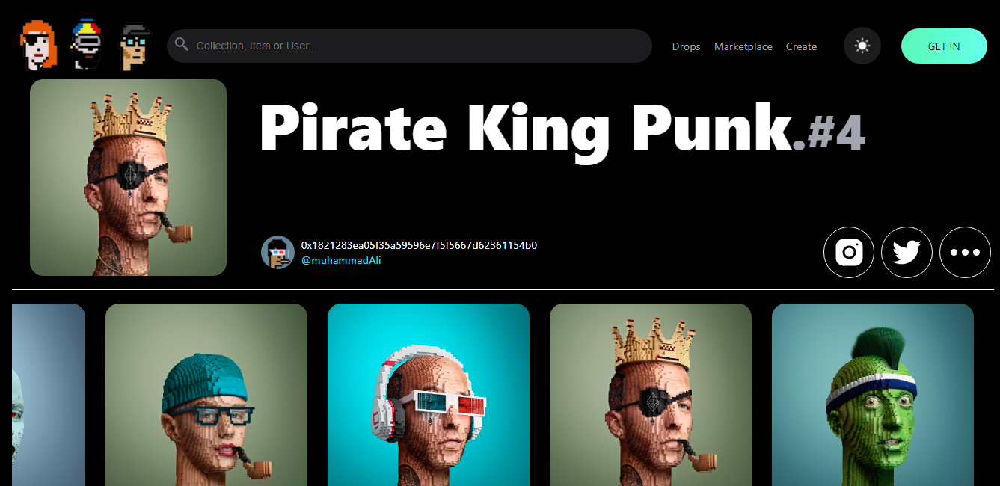
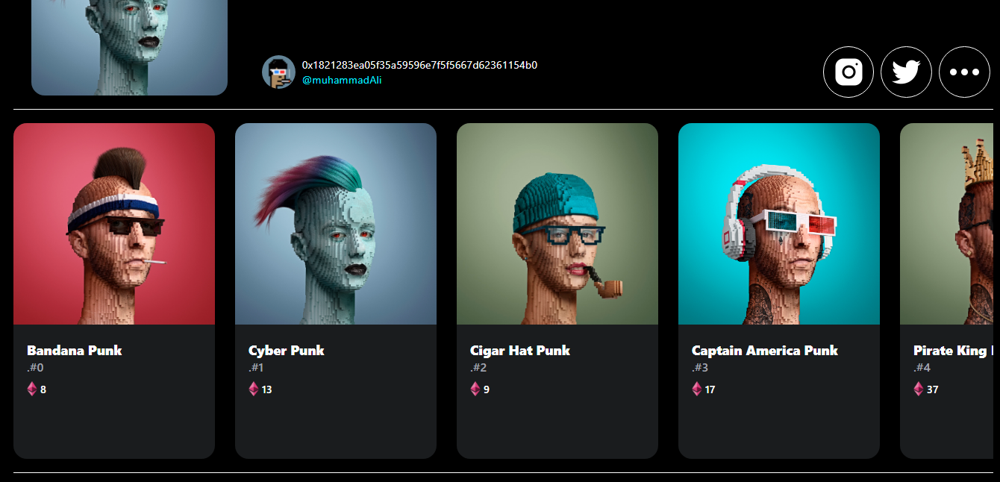

# React Web 3.0 App

### _React Web3 NFT Listing Web Application using ReactJs, Thirdweb and opensea api and metamask wallet_

### :link: https://react-nft-project.netlify.app/

### Learned from : [https://youtu.be/hhZtiytNaBQ](Clever Programmer)

## Images

**NOTE: It's not Mobile Responsive**

## Run Locally

- Run this command to git clone. 

         https://github.com/aliaftabsheikh/React-NFT-App.git

- You are now in the dev environment and you can play around

## Technologies Use

- HTML5
- CSS3
- React js (Frontend)
- Thirdweb (To mint NFTs and list on opensea)
- Opensea (To fetch and List NFTs)
- Metamask Wallet (To connect with Thirdweb)